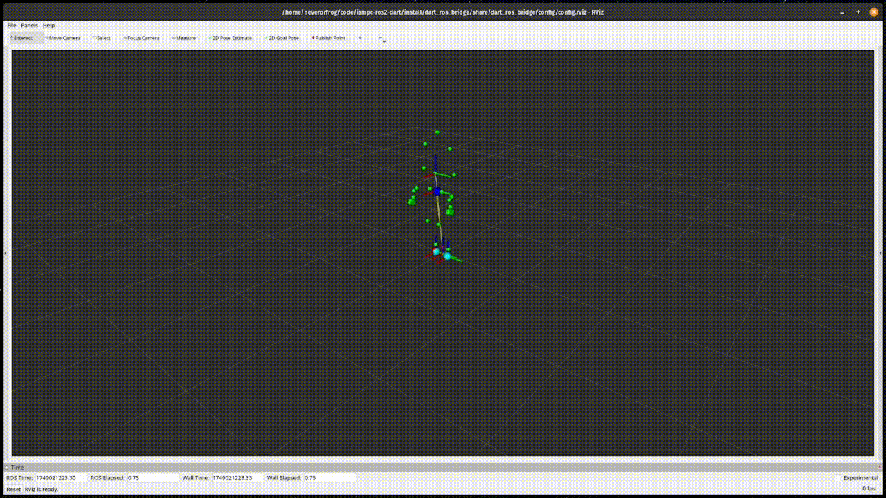

# ISMPC ROS2

## Installation And Usage

Clone the repo recursively

To build the code, run 

```
pixi run colcon build
```

and then in two separate terminals, first run

```
pixi run ismpc
```

and then

```
pixi run dart
```


## Demo

